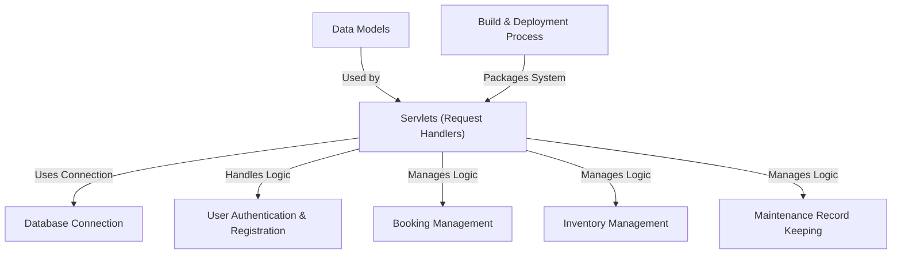

# Tutorial: CWMANS

This project is a **Car Workshop Management System**. It provides a web interface where users can **book appointments** and manage workshop operations.
It handles **user logins** and registrations, keeps track of **spare parts inventory**, and records **maintenance history** for vehicles, all while connecting to a **database** to store information.

## Visual Overview

## Chapters

1. [Data Models](docs/01_data_models_.md)
2. [Database Connection](docs/02_database_connection_.md)
3. [Servlets (Request Handlers)](docs/03_servlets__request_handlers__.md)
4. [User Authentication & Registration](docs/04_user_authentication___registration_.md)
5. [Booking Management](docs/05_booking_management_.md)
6. [Inventory Management](docs/06_inventory_management_.md)
7. [Maintenance Record Keeping](docs/07_maintenance_record_keeping_.md)
8. [Build & Deployment Process](docs/08_build___deployment_process_.md)

---

