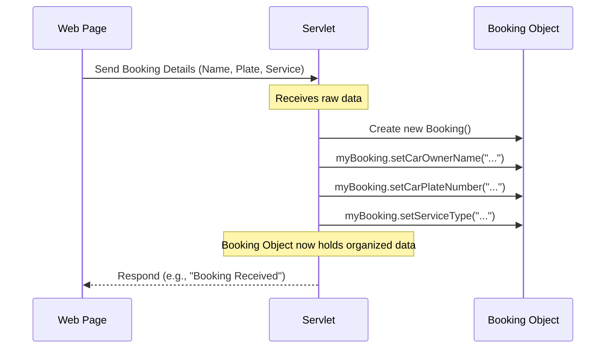

# Chapter 1: Data Models

Welcome to the first chapter of our tutorial on the `Muhammad-Asyiq-Danial` project! We're going to start with the absolute basics: how our application thinks about and organizes information.

Imagine you're building a car service booking system. What kind of information do you need to handle? You'll need details about the booking itself (like who is booking, what car, what service), details about the customer, maybe details about the cars being serviced, and so on.

If all this information was just floating around unstructured, it would be a mess! How would you know which car belongs to which customer, or which service type is requested for a specific booking?

This is where **Data Models** come in.

## What are Data Models?

Think of a Data Model as a **blueprint** or a **template** for a specific type of information. Just like a blueprint for a house tells you where the rooms are and what walls go where, a data model tells you what pieces of information belong together to describe one "thing" (like a booking, a user, or a car).

In our project, these data models are written as simple **Java classes**. They define the structure of the data. For example, a "Booking" blueprint needs spaces for the owner's name, car plate number, service type, etc. A "User" blueprint needs spaces for a username, password, contact info, and role (like staff or customer).

They are like digital forms designed to collect and hold specific kinds of details.

## Anatomy of a Simple Data Model

Let's look at one of the data models from the project: the `Booking` data model. This class is designed to hold all the information related to a single car service booking.

Here's the code for the `Booking.java` file:

```java
package com.model;

public class Booking {
    private int id;
    private String carOwnerName;
    private String carPlateNumber;
    private String contactNumber;
    private String carModel;
    private String serviceType;

    // Getters and Setters
    public int getId() { /* ... code ... */ }
    public void setId(int id) { /* ... code ... */ }
    // ... other getters and setters ...
}
```

Let's break down the key parts:

1.  **`package com.model;`**: This line just says where this file lives within the project structure. All our data models are kept neatly together in the `com.model` package.

2.  **`public class Booking { ... }`**: This declares a class named `Booking`. This is our blueprint! It defines the structure for what a "Booking" looks like in our application.

3.  **`private int id;`, `private String carOwnerName;`, etc.**: These lines declare **variables**. These are the specific pieces of information that *each* `Booking` object will hold.
    *   `id`: A number to uniquely identify this booking.
    *   `carOwnerName`: The name of the car's owner.
    *   `carPlateNumber`: The license plate number of the car.
    *   `contactNumber`: How to contact the owner.
    *   `carModel`: The make and model of the car.
    *   `serviceType`: What kind of service is requested (e.g., oil change, repair).
    *   The `private` keyword means these variables can only be directly accessed or changed from *inside* this `Booking` class itself. This is a programming practice called **encapsulation**, which helps keep our data safe and controlled.

4.  **Getters and Setters (`public int getId()`, `public void setId(int id)`, etc.)**: Since the variables are `private`, we need ways to read their values (`get`) and change their values (`set`) from outside the class.
    *   A **Getter** method (like `getCarOwnerName()`) simply returns the value of a private variable. It lets you *get* the data.
    *   A **Setter** method (like `setCarOwnerName(String name)`) takes a value and assigns it to a private variable. It lets you *set* or change the data.

Other data models like `User.java`, `Car.java`, and `Contact.java` follow the same pattern. They define their own set of `private` variables to hold relevant information (e.g., `User` has `username`, `password`, `role`; `Car` has `plateNumber`, `model`, `ownerName`) and provide public getter and setter methods for each. Some also have **Constructors**, which are special methods used when you first create an object to give initial values to its variables.

Here's a look at the `User` data model structure:

```java
package com.model;

public class User {
    private String username;
    private String password;
    private String contactNumber;
    private String email;
    private String role; // "staff" or "customer"

    // Constructor (to create a User object)
    public User(String username, String password, /* ... */) {
        this.username = username;
        // ... assign other values ...
    }

    // Getters and Setters
    public String getUsername() { /* ... code ... */ }
    public void setUsername(String username) { /* ... code ... */ }
    // ... other getters and setters ...
}
```

This `User` blueprint defines the core pieces of information needed for any user account in our system.

## Using a Data Model

So, how do we use these blueprints? We create objects (or **instances**) based on them. Think of creating an object as filling out a specific form based on the blueprint.

Here's a simple example of creating a `Booking` object and using its setters and getters:

```java
// Create a new Booking object (like getting a blank booking form)
Booking myBooking = new Booking();

// Use setters to fill in the details on the form
myBooking.setCarOwnerName("Alice Smith");
myBooking.setCarPlateNumber("SMC 1234 A");
myBooking.setServiceType("Oil Change");
myBooking.setContactNumber("98765432");

// Now, use getters to read the details from the form
String owner = myBooking.getCarOwnerName();
String service = myBooking.getServiceType();

// You could then print these values, save them, etc.
System.out.println("Booking Owner: " + owner);
System.out.println("Requested Service: " + service);
```

When you run this code:

```
Booking Owner: Alice Smith
Requested Service: Oil Change
```

This shows how the `Booking` object (`myBooking`) holds the specific data we assigned to it using the setter methods, and how we can retrieve that data using the getter methods.

## Data Models in Action (Conceptual Flow)

Let's visualize how a `Booking` object might be used very simply. Imagine a user submits a booking request through a web page.



In this simplified flow, the `Servlet` (which handles incoming requests, more on this in [Servlets (Request Handlers)](03_servlets__request_handlers__.md)) takes the raw data from the web page and uses the `Booking` data model to create a structured object that holds all that information neatly. This organized object is much easier to work with for the rest of the application's tasks, like saving it to a database.

## Why Are Data Models Important?

Using data models provides several benefits:

*   **Organization:** They keep related pieces of information together. Instead of separate variables for `ownerName`, `plateNumber`, etc., we have one `Booking` object containing all of them.
*   **Clarity:** The code becomes easier to read and understand. When you see `Booking myBooking`, you immediately know this object represents a complete booking entry.
*   **Consistency:** They ensure that wherever we deal with a "Booking" or a "User", we expect and use the same structure of data.
*   **Preparation for Database:** As we'll see in the next chapter, data models often map very closely to how information is stored in a database. Having data models ready makes it easier to save data *to* and load data *from* the database.

## Conclusion

In this chapter, we learned that data models are simple Java classes that act as blueprints for organizing data within our application. They define the structure of key pieces of information like Bookings, Users, and Cars. We saw how they use private variables to hold data and public getter/setter methods to control access to that data. These models are the fundamental building blocks for managing information in the `Muhammad-Asyiq-Danial` project.

In the next chapter, we'll explore how our application connects to a database and how these data models help us store and retrieve this organized information persistently.

[Next Chapter: Database Connection](docs/02_database_connection_.md)

---

<sub><sup>Generated by [AI Codebase Knowledge Builder](https://github.com/The-Pocket/Tutorial-Codebase-Knowledge).</sup></sub> <sub><sup>**References**: [[1]](https://github.com/KhairyHelmy/Muhammad-Asyiq-Danial/blob/f67d8f0d949957be9179d72bc35a593e95347bd1/src/main/java/java/com/model/Booking.java), [[2]](https://github.com/KhairyHelmy/Muhammad-Asyiq-Danial/blob/f67d8f0d949957be9179d72bc35a593e95347bd1/src/main/java/java/com/model/Car.java), [[3]](https://github.com/KhairyHelmy/Muhammad-Asyiq-Danial/blob/f67d8f0d949957be9179d72bc35a593e95347bd1/src/main/java/java/com/model/Contact.java), [[4]](https://github.com/KhairyHelmy/Muhammad-Asyiq-Danial/blob/f67d8f0d949957be9179d72bc35a593e95347bd1/src/main/java/java/com/model/User.java)</sup></sub>
